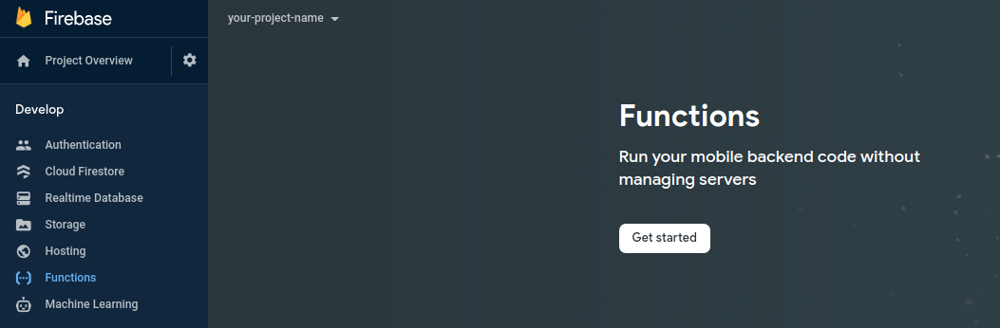
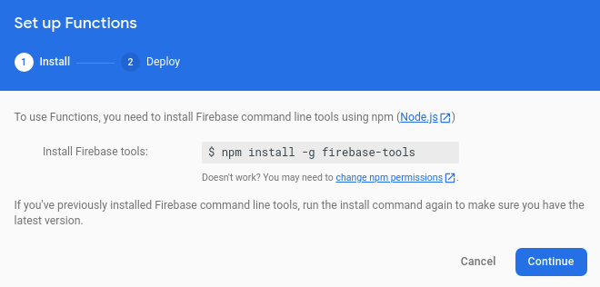
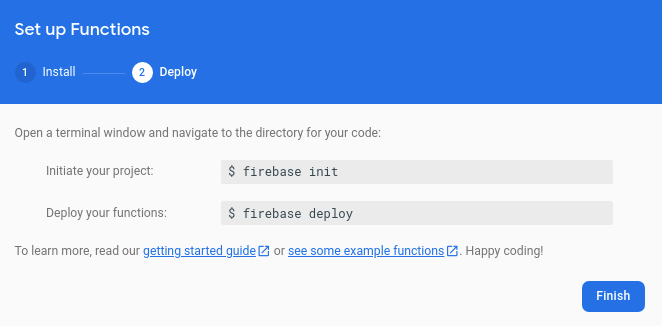
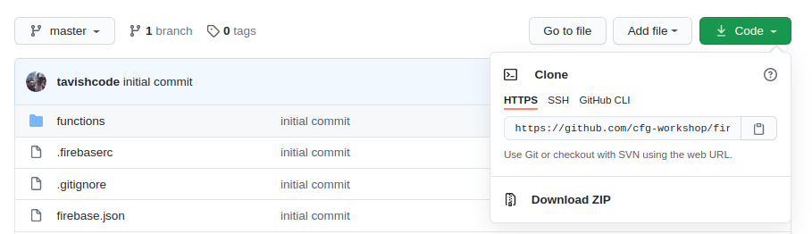
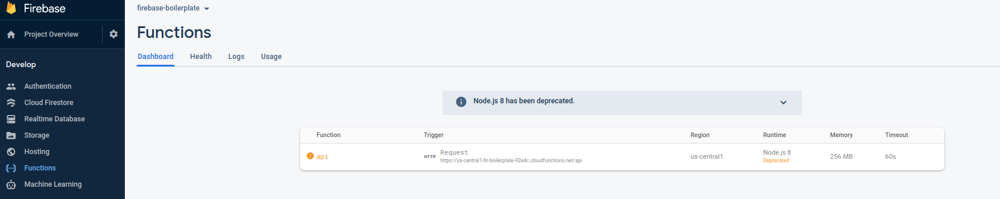

# Setting up NodeJS & Firebase

## Installations

### Installing an IDE

If you don't already have a preferred IDE, we recommend installing VSCode
https://code.visualstudio.com/download

### Installing Git

**Windows**

https://git-scm.com/download/win

**Linux (Ubuntu)**

```
$ sudo apt install git-all
```

**Mac Mavericks(10.9) and up**

```
$ git --version
```

Running this command from the terminal will prompt you to install it, if it doesn't already exist

**Troubleshooting**

https://git-scm.com/book/en/v2/Getting-Started-Installing-Git

### Installing Node JS

**Windows**

Using the windows installer from the NodeJS Website

https://nodejs.org/en/download/

**Mac / Linux**

Using nvm (Node Version Manager)

```
curl -o- https://raw.githubusercontent.com/nvm-sh/nvm/v0.35.3/install.sh | bash
```

Troubleshooting: https://github.com/nvm-sh/nvm

### Installing Firebase Tools

Using npm (node package manager)

```
npm install -g firebase-tools
```

Troubleshooting: https://github.com/firebase/firebase-tools

## Setup

### Creating a Firebase Project

Visit the firebase console and create a new project

https://console.firebase.google.com/

**Step 1**


Click `Add Project`

**Step 2**


Name your project

**Step 3**


Click `Continue`

**Step 4**


Select `Default Account for Firebase` and Click `Create Proeject`

**Step 5**


Click `Continue`

**Step 6**


Select `Cloud Firestore` from the sidebar and Click `Create Database`

**Step 7**


These are the security rules for the db, just Click `Next`

**Step 8**


No need to change the location, just Click `Next`

**Step 9**


Your Cloud Firestore has been initialized

**Step 10**



Select `Functions` from the sidebar and Click `Get Started`

**Step 10**



No need to execute the above command as you've already installed `fiebase-tools`, just Click `Continue`

**Step 11**



No need to execute these commands as you'll be cloning the firebase-boilerplate repository which is already initialized, just Click `Finish`

## Deploying "Hello World" Backend

### Clone Boilerplate Repository

Visit https://github.com/cfg-workshop/firebase-boilerplate



Click `Code` and copy the HTTPS url

Then, run the following command in your workspace

```
git clone url-you-just-copied
```

### Connect Codebase to Firebase Project

After cloning the project, you'll see many files such as `.firebaserc` `.gitignore` ...(more) and a `functions/` folder

To connect this codebase to your own firebase project run the following command in your workspace

```
firebase use --add
```

Select your `project-id` from the dropdown presented

Create an alias called `default`

If you face any issues, it may be because you're not logged in. Running the following command may help

```
firebase login
```

Example:


### Deploy your server

Run the following command

```
firebase deploy
```

Your server should now be online.

You can find the url of your server by visiting your Firebase Functions Dashboard



## Conclusion

Congrats, you're done! That's all the pre-work you need for the NodeJS and Firebase Workshop

If you're curious and want to read more on the tools we're using, you can visit these links:

- Firebase Cloud Functions: https://firebase.google.com/docs/functions
- Firebase Cloud Firestore: https://firebase.google.com/docs/firestore
- Express Framework for NodeJS: https://expressjs.com/
- Swagger UI Express: https://www.npmjs.com/package/swagger-ui-express
- Swagger JSDoc: https://github.com/Surnet/swagger-jsdoc
