# Setting up NodeJS & Firebase

## Installations

### Installing an IDE

If you don't already have a preferred IDE, we recommend installing VSCode
https://code.visualstudio.com/download

### Installing Git

**Windows**

https://git-scm.com/download/win

**Linux (Ubuntu)**

```
$ sudo apt install git-all
```

**Mac Mavericks(10.9) and up**

```
$ git --version
```

Running this command from the terminal will prompt you to install it, if it doesn't already exist

**Troubleshooting**

https://git-scm.com/book/en/v2/Getting-Started-Installing-Git

### Installing Node JS

**Windows**

Using the windows installer from the NodeJS Website

https://nodejs.org/en/download/

**Mac / Linux**

Using nvm (Node Version Manager)

```
curl -o- https://raw.githubusercontent.com/nvm-sh/nvm/v0.35.3/install.sh | bash
```

Troubleshooting: https://github.com/nvm-sh/nvm

### Installing Firebase Tools

Using npm (node package manager)

```
npm install -g firebase-tools
```

Troubleshooting: https://github.com/firebase/firebase-tools

## Setup

### Creating a Firebase Project

Visit the firebase console and create a new project

https://console.firebase.google.com/

**Step 1**

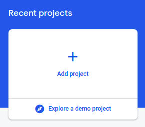

Click `Add Project`

**Step 2**


Name your project

**Step 3**

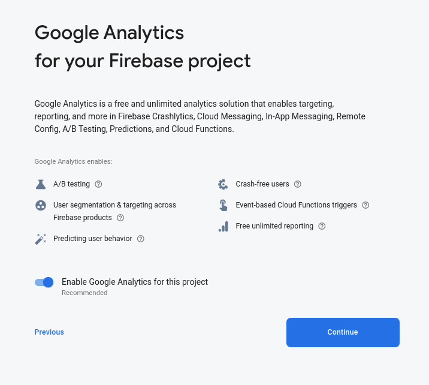

Click `Continue`

**Step 4**

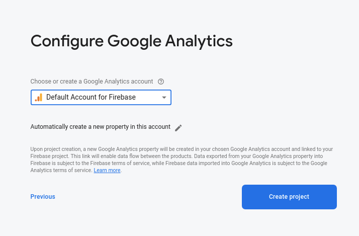

Select `Default Account for Firebase` and Click `Create Proeject`

**Step 5**

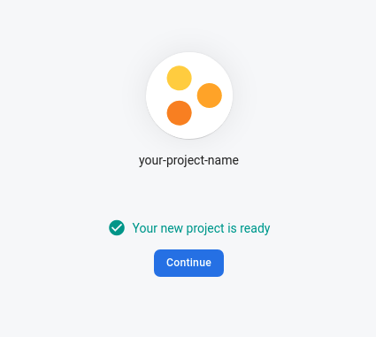

Click `Continue`

**Step 6**

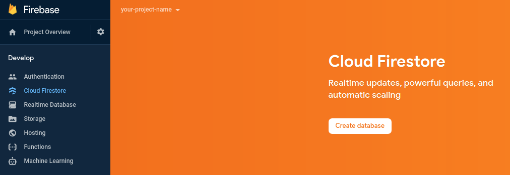

Select `Cloud Firestore` from the sidebar and Click `Create Database`

**Step 7**

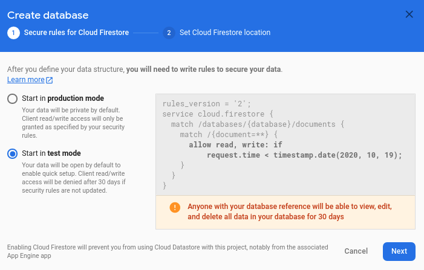

These are the security rules for the db, just Click `Next`

**Step 8**

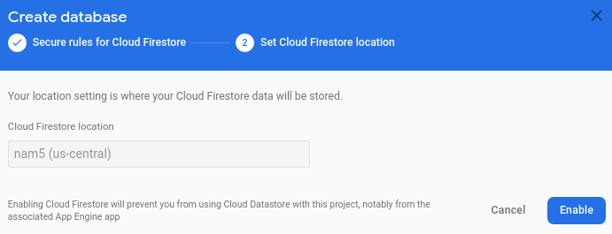

No need to change the location, just Click `Enable`

**Step 9**

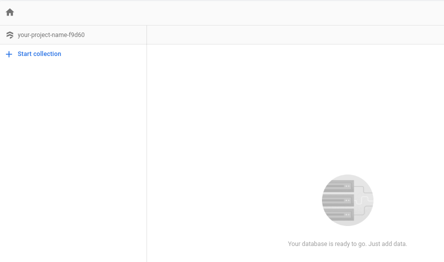

Your Cloud Firestore has been initialized

## Deploying "Hello World" Backend

### Clone Boilerplate Repository

Pick a workspace for your project and open a terminal in your workspace directory

Then, run the following command in your workspace

```
git clone https://github.com/cfg-workshop/firebase-boilerplate.git
```

### Connect Codebase to Firebase Project

After cloning the project, navigate to the `/firebase-boilerplate` folder, you'll see many files such as `.firebaserc` `.gitignore` ...(more) and folders such as `assets/`, `public/` and `functions/`.

- `assets/` contains the images you see in this readme, so you can just ignore it
- `public/` contains the static website that we will be using as our documentation and api playground
- `functions/` contains your backend server

To connect this codebase to your own firebase project run the following command inside the `/firebase-boilerplate` directory

```
firebase use --add
```

Select your `project-id` from the dropdown presented

Create an alias called `default`

If `firebase` isn't a recognized command, make sure you have installed `firebase-tools` (instructions earlier in the readme)

If you face any further issues, it may be because you're not logged in. Running the following command may help

```
firebase login
```

Example:

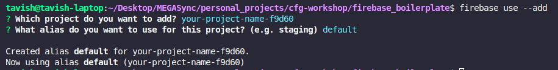

### Deploy your server

First let's make sure that all dependencies are installed. Navigate to the `functions/` folder in your terminal and run the following command

```
npm install
```

Now you can deploy by running the following command

```
firebase deploy
```

If the deployment was successful, you will see something like this in your terminal. The URLs you see will be different as it is dependent on your personal firebase project

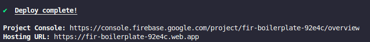

`Project Console` is the console for your backend server. Over here you can see the logs and usage statistics of your server

`Hosting URL` is the website where your backend documentation and api playground is hosted. The API playground would not work right now, as the api is not yet implemented in this boilerplate. We will work on this together during the workshop

If your deployment failed, make sure you've correctly added your project and set up the alias in the previous step. You should also check that you have created a Cloud Firestore in your Firebase console.

### Running your server without deploying

When debugging, you might find it very tedious to keep deploying after every change. You might also not want to manipulate your database when testing functions which would behave unexpectedly.

So when you are actively developing and testing, we recommend you to use firebase's emulators. This runs your server and documentation website on your localhost and creates a local firestore which you can mess around with.

To use the emulators, run the following command

```
firebase emulators:start
```

_Note: Emulators require Java to be installed in your machine. If you don't already have it, you can find installation instructions here 
https://www.java.com/en/download/manual.jsp_

If the command was sucessful, you should see something like this

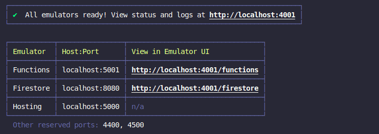

`Functions` is where your backend server is located

`Firestore` is our test database

`Hosting` is where our documentation and api playground is located

## Conclusion

Congrats, you're done! That's all the pre-work you need for the NodeJS and Firebase Workshop

If you're curious and want to read more on the tools we're using, you can visit these links:

- Firebase Cloud Functions: https://firebase.google.com/docs/functions
- Firebase Cloud Firestore: https://firebase.google.com/docs/firestore
- Express Framework for NodeJS: https://expressjs.com/
- Swagger UI: https://github.com/swagger-api/swagger-ui
